# Task 2: Create database and table in your MySQL server

- Create a new database named website.

        CREATE DATABASE website;

  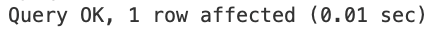

- Create a new table named member, in the website database, designed as below:

|  Column Name   |                                Description                                 |
| :------------: | :------------------------------------------------------------------------: |
|       id       | Unique ID for Member in Non-Negative Integer. Primary Key. Auto Increment. |
|      name      |                  Name < 255 Characters. Cannot be Empty.                   |
|     email      |                  Email < 255 Characters. Cannot be Empty.                  |
|    password    |                Password < 255 Characters. Cannot be Empty.                 |
| follower_count |   Follower Count in Non-Negative Integer. Cannot be Empty. Default to 0.   |
|      time      |         Signup DateTime. Cannot be Empty. Default to Current Time.         |

        USE website;
        CREATE TABLE member(
        id INT UNSIGNED AUTO_INCREMENT,
        name VARCHAR(255) NOT NULL,
        email VARCHAR(255) NOT NULL,
        password VARCHAR(255) NOT NULL,
        follower_count INT UNSIGNED NOT NULL DEFAULT 0,
        time TIMESTAMP NOT NULL DEFAULT CURRENT_TIMESTAMP
        PRIMARY KEY (ID));

  

  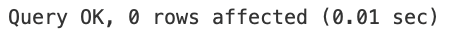

# Task 3: SQL CRUD

- INSERT a new row to the member table where name, email and password must be set to test, test@test.com, and test. INSERT additional 4 rows with arbitrary data.

        INSERT INTO member(name, email, password)
        VALUES ('test', 'test@test.com', 'test');
        INSERT INTO member(name, email, password, follower_count, time)
        VALUES
        ('Alice', 'alice@example.com', 'pass123', 5, '2025-11-12 09:15:00'),
        ('Bob', 'bob@example.com', 'secret456', 12, '2025-11-13 14:30:00'),
        ('Cathy', 'cathy@example.com', 'mypwd789', 3, '2025-11-14 11:45:00'),
        ('David', 'david@example.com', 'abc987', 8, '2025-11-15 16:20:00');

  

  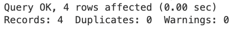

- SELECT all rows from the member table.

        SELECT * FROM member;

  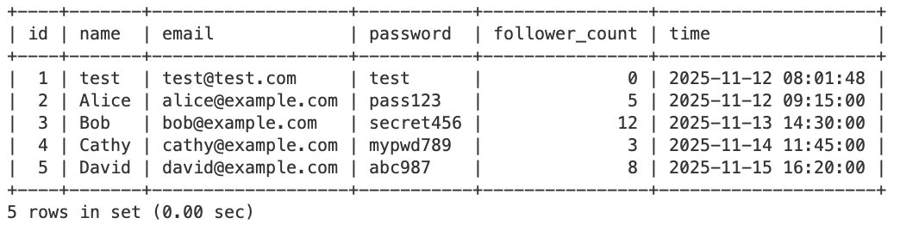

- SELECT all rows from the member table, in descending order of time.

        SELECT *
        FROM member
        ORDER BY time DESC;

  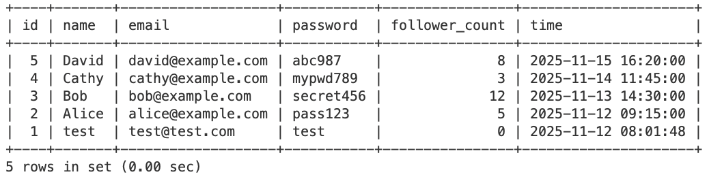

- SELECT total 3 rows, second to fourth, from the member table, in descending order of time. Note: it does not mean SELECT rows where id are 2, 3, or 4.

        SELECT *
        FROM member
        ORDER BY time DESC
        LIMIT 3 OFFSET 1;

  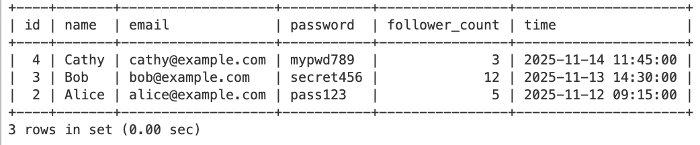

- SELECT rows where email equals to test@test.com .

        SELECT *
        FROM member
        WHERE email = 'test@test.com';

  

- SELECT rows where name includes the es keyword.

        SELECT *
        FROM member
        WHERE name LIKE '%es%';

  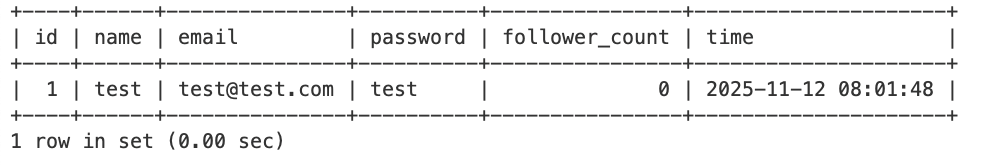

- SELECT rows where email equals to test@test.com and password equals to test .

        SELECT *
        FROM member
        WHERE email = 'test@test.com' AND password = 'test';

  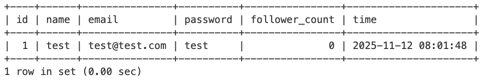

- UPDATE data in name column to test2 where email equals to test@test.com .

  

# Task 4: SQL Aggregation Functions

- SELECT how many rows from the member table.

        SELECT COUNT(*)
        FROM member;

  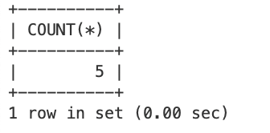

- SELECT the sum of follower_count of all the rows from the member table.

        SELECT SUM(follower_count)
        FROM member;

  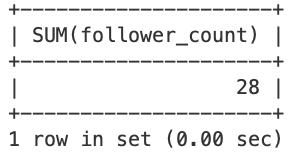

- SELECT the average of follower_count of all the rows from the member table.

        SELECT AVG(follower_count)
        FROM member;

  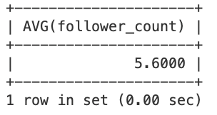

- SELECT the average of follower_count of the first 2 rows, in descending order of follower_count, from the member table.

        SELECT AVG(follower_count)
        FROM (
             SELECT follower_count
             FROM member
             ORDER BY follower_count DESC
             LIMIT 2
         ) AS top2;

  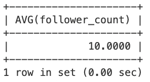

# Task 5: SQL JOIN

- Create a new table named message , in the website database. designed as below:

| Column Name |                                                  Description                                                   |
| :---------: | :------------------------------------------------------------------------------------------------------------: |
|     id      |                   Unique ID for Message in Non-Negative Integer. Primary Key. Auto Increment                   |
|  member_id  | Member ID for Message Sender. Cannot be Empty. Must be Foreign Key refer to the id column in the member table. |
|   content   |                                  Content < 65535 Characters. Cannot be Empty.                                  |
| like_count  |                       Like Count in Non-Negative Integer. Cannot be Empty. Default to 0.                       |
|    time     |                          Publish DateTime. Cannot be Empty. Default to Current Time.                           |

        CREATE TABLE message(
         id INT UNSIGNED AUTO_INCREMENT,
         member_id INT UNSIGNED NOT NULL,
         content TEXT NOT NULL,
         like_count INT UNSIGNED NOT NULL DEFAULT 0,
         time TIMESTAMP NOT NULL DEFAULT CURRENT_TIMESTAMP,
         PRIMARY KEY(id),
         FOREIGN KEY (member_id) REFERENCES member(id));

  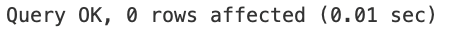

- SELECT all messages, including sender names. We have to JOIN the member table to get that.

        SELECT member.name, message.*
         FROM member
         LEFT JOIN message
         ON member.id = message.member_id;

  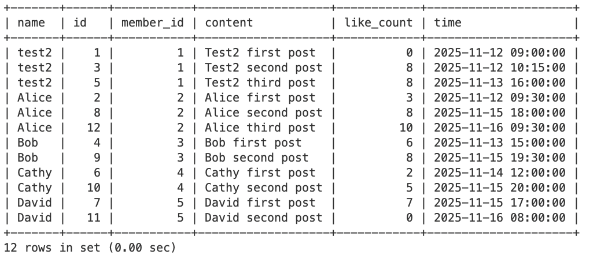

- SELECT all messages, including sender names, where sender email equals to test@test.com. We have to JOIN the member table to filter and get that.

        SELECT member.name, message.*
         FROM member
         LEFT JOIN message
         ON member.id = message.member_id
         WHERE member.email = 'test@test.com';

  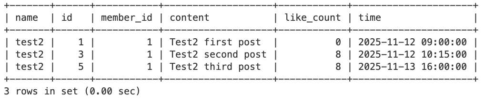

- Use SELECT, SQL Aggregation Functions with JOIN statement, get the average like count of messages where sender email equals to test@test.com.
  SELECT AVG(message.like_count)
  FROM member
  LEFT JOIN message
  ON member.id = message.member_id
  WHERE member.email = 'test@test.com';

  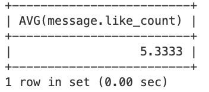

- Use SELECT, SQL Aggregation Functions with JOIN statement, get the average like count of messages GROUP BY sender email.

        SELECT member.email, AVG(message.like_count)
         FROM member
         LEFT JOIN message
         ON member.id = message.member_id
         GROUP BY member.email;

  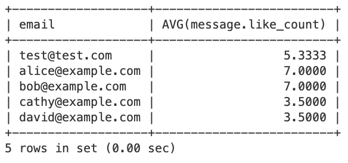

